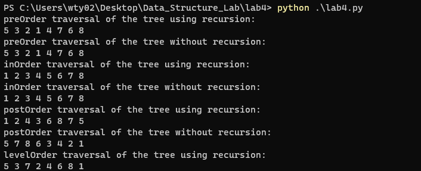

# 实验四 二叉树遍历的实验报告

**时间：2022年5月22日**

**姓名：王天一**

**目录**

[TOC]

## 问题描述

建立以左右孩子链接结构表示的二叉树，实现二叉树的先序、中序、后序的递归和非递归遍历及分层遍历。

## 测试用例

二叉树序列 ：

**5,3,7,2,4,6,8,1**

二叉树图片:


测试代码

```python
if __name__ == '__main__':
    pre = [5,3,7,2,4,6,8,1]
    tree = Tree()
    tree.root = TreeNode(pre[0])
    for i in range(1, len(pre)):
        tree.add(pre[i])
    print('preOrder traversal of the tree using recursion:')
    preOrder_recursion(tree.root)
    print('\npreOrder traversal of the tree without recursion:')
    preOrderNotRecursion(tree.root)
    print('\ninOrder traversal of the tree using recursion:')
    inOrder_recursion(tree.root)
    print('\ninOrder traversal of the tree without recursion:')
    inOrderNotRecursion(tree.root)
    print('\npostOrder traversal of the tree using recursion:')
    postOrder_recursion(tree.root)
    print('\npostOrder traversal of the tree without recursion:')
    postOrderNotRecursion(tree.root)
    print('\nlevelOrder traversal of the tree using recursion:')
    levelOrder(tree.root)
```

测试结果



## 算法思路

### 节点的构建

```python
class TreeNode():
    def __init__(self, x):
        """Create a tree node with a given value.

        Args:
            x : the value of the node.
        """
        self.val = x
        self.left = None
        self.right = None
```

创建一个节点类，共有三个属性，val（本身的值），left和right（左右子节点的值）

### 二叉树的构建

对于二叉树的构建，我构建了一个Tree类，使用add函数添加。

```python
class Tree:
    def __init__(self):
        self.root = None  # 初始化时根节点为None
        self.queue = [] 
    def add(self,item):
        """Add a node to the tree.
        
        Args:
            item : the value of the node.
        """
        node = TreeNode(item)
        if self.root is None:# if the tree is empty, the root is the new node
            self.root = node
            return 
        queue = [self.root]
        while queue:
            cur_node = queue.pop(0)
            if cur_node.left is None:
                # if the left child is empty, add the new node to the left child
                cur_node.left = node
                return
            else:
                # if the left child is not empty, add the new node to the right child
                queue.append(cur_node.left)
            
            if cur_node.right is None:
                cur_node.right = node
                return
            else:
                queue.append(cur_node.right)
```


### 先序遍历

#### 使用递归

对于使用递归的先序遍历，使用DFS思想可以很好解决，我们只需要规定当输入的root为空时直接返回None，如果不为空则先打印当前节点的值，然后依次调用左节点和右节点。

```python
def preOrder_recursion(root):
    """preOrder traversal of the tree using recursion.

    Args:
        root (TreeNode): the root node of the tree.
    """

    if root is None:
        return
    print(root.val, end=' ')
    preOrder_recursion(root.left)
    preOrder_recursion(root.right)
```

#### 不使用递归

对于不使用递归的前序遍历，我们使用栈的数据结构来解决，通过设置一个节点栈，一开始只有根节点一个，如果根节点为空值，直接返回；然后使用while循环，当节点栈不为空时，取出栈顶的节点，打印其值，然后将左、右节点依次压入栈，直到栈空。

```bash
def preOrderNotRecursion(root):
    """preOrder traversal of the tree without recursion.
    
    Args:
        root (TreeNode): the root node of the tree.
    """
    if root is None:
        return
    stack = [root]
    while len(stack) > 0:
        node = stack.pop()
        print(node.val, end=' ')
        if node.right is not None:
            stack.append(node.right)
        if node.left is not None:
            stack.append(node.left)
```


### 中序遍历

#### 使用递归

使用递归的中序遍历和递归的前序遍历相差无几，唯一不一样的是函数调用和打印当前节点的顺序，中序遍历的顺序为：先调用左节点的函数，然后打印当前节点的值，再调用右节点的函数。

```python
def inOrder_recursion(root):
    """inOrder traversal of the tree using recursion.

    Args:
        root (TreeNode): the root node of the tree.
    """
    if root is None:
        return
    inOrder_recursion(root.left)
    print(root.val, end=' ')
    inOrder_recursion(root.right)
```

#### 不使用递归

首先我们建立一个节点栈，当输入的根节点为空时直接返回，当根节点不为空或者栈不为空时，反复执行以下操作：

1. 当根节点不为空时，将根节点压入栈，并将其叶子节点赋值给其本身。
2. 当根节点为空时，从栈顶取出一个节点赋值给根节点，然后打印出根节点的值，最后将根节点赋值为其右叶子节点。

```python
def inOrderNotRecursion(root):
    """inOrder traversal of the tree without recursion.

    Args:
        root (TreeNode): the root node of the tree.
    """
    if root is None:
        return
    stack = []
    while len(stack) > 0 or root is not None:
        if root is not None:
            stack.append(root)
            root = root.left
        else:
            root = stack.pop()
            print(root.val, end=' ')
            root = root.right
```

### 后序遍历

#### 使用递归

使用递归的后序遍历仍然与使用递归的前序、中序相差不大，只需要先调用左右节点的函数，再打印根节点的值即可。

```python
def postOrder_recursion(root):
    """postOrder traversal of the tree using recursion.

    Args:
        root (TreeNode): the root node of the tree.
    """
    if root is None:
        return
    postOrder_recursion(root.left)
    postOrder_recursion(root.right)
    print(root.val, end=' ')
```

#### 不使用递归

对于不使用递归的后续遍历，也使用了栈的数据结构。

首先我们判断输入是为空，如果为空直接返回。然后构建一个初始包含根节点的节点栈，当节点栈不为空时反复执行以下操作：

1. 从节点栈取出一个节点赋值给node
2. 如果node存在左叶子节点，将其左叶子节点压入节点栈
3. 如果node存在右叶子节点，将其右叶子节点压入节点栈
4. 打印node的值

```python
def postOrderNotRecursion(root):
    """postOrder traversal of the tree without recursion.

    Args:
        root (TreeNode): the root node of the tree.
    """
    if root is None:
        return
    stack = [root]
    while len(stack) > 0:
        node = stack.pop()
        if node.left is not None:
            stack.append(node.left)
        if node.right is not None:
            stack.append(node.right)
        print(node.val, end=' ')
```

### 层次遍历

对于层次遍历，我们使用BFS的思想即可。

首先我们判断输入的二叉树是否为空，如果不为空建立队列，初值为根节点，当队列不为空的时候反复执行以下操作：

1. 从队列中取出一个节点赋值给node。
2. 打印该节点的值。
3. 如果左叶子节点不为空，则将其加入队列。
4. 如果右叶子节点不为空，则将其加入队列。

```python
def levelOrder(root):
    """levelOrder traversal of the tree using recursion.

    Args:
        root (TreeNode): the root node of the tree.
    """
    if root is None:
        return
    queue = [root]
    while len(queue) > 0:
        node = queue.pop(0)
        print(node.val, end=' ')
        if node.left is not None:
            queue.append(node.left)
        if node.right is not None:
            queue.append(node.right)
```

